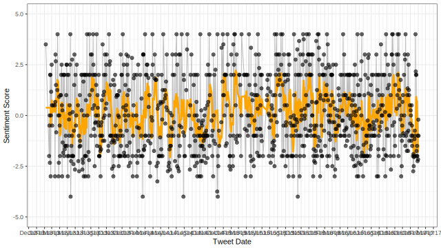

This is a look at the sentiment of tweets by President Trump (@realDonaldTrump).

The approach is similar to that by David Robinson's post [Text analysis of Trump's tweets confirms he writes only the (angrier) Android half](http://varianceexplained.org/r/trump-tweets/).

However I'm interested in whether the sentiment of Trump's tweets have changed over time.

```{r Preamble, include=FALSE, message=FALSE}
library(dplyr)
library(tidyr)
library(purrr)
library(twitteR)
library(tidytext)
library(magrittr)
library(stringr)
library(lubridate)
library(plotly)

knitr::opts_chunk$set(echo = TRUE, include = FALSE)

setup_twitter_oauth(Sys.getenv("twitter_consumer_key"),
                    Sys.getenv("twitter_consumer_secret"),
                    Sys.getenv("twitter_access_token"),
                    Sys.getenv("twitter_access_token_secret"))
```

## Fetching all of the tweets

The Twitter API supports a maximum of 3,200 tweets per request. Fortunately we can make multiple requests.

```{r Fetch tweets, eval=FALSE}
trump_tweets <- userTimeline("realDonaldTrump", n = 3200)

n <- TRUE
while (n){
    minID <- trump_tweets %>%
        map_df(as.data.frame) %>%
        tbl_df() %>%
        summarize(id = min(id)) %>% 
        extract2("id")
    
    newTweets <- userTimeline("realDonaldTrump", n = 3200, maxID = minID)
    if (length(newTweets)==0){
        n <- FALSE
    } else {
        trump_tweets <- append(trump_tweets, newTweets)
    }
}

trump_tweets_df <- trump_tweets %>%
    map_df(as.data.frame) %>%
    tbl_df()
```

```{r}
trump_tweets_df <- readr::read_csv("political_twitter_archive/realdonaldtrump/realdonaldtrump.csv") %>%
    mutate(
        created = lubridate::parse_date_time(created_at, orders = "a b d H:M:S z Y")
    )
```

## Trump's tweets vs. his staff

In David Robinson's blog post, he determined tweets by Trump are made from his Android phone while his staff tweets from an iPhone. Therefore I restricted the data to tweets made from an Android phone.

```{r Isolate tweets by Trump himself}
tweets <- trump_tweets_df %>%
    filter(str_detect(source, "Android")) %>%
    dplyr::select(id=id_str, text, created)
```

## Text processing

I unnested the tokens (words) from the tweets using regex and filtered stop words.

```{r Unnest tokens and remove stop words}
reg <- "([^A-Za-z\\d#@']|'(?![A-Za-z\\d#@]))"
tweet_words <- tweets %>%
  filter(!str_detect(text, '^"')) %>%
  unnest_tokens(output = word,
                input = text,
                token = "regex",
                pattern = reg) %>%
  filter(!word %in% stop_words$word,
         str_detect(word, "[a-z]"))
```

I then assigned each word a sentiment score. I used the AFINN word list to be consistent with David Robinson. Arguably the it would be good to compare to the `bing` and `nrc` lexicons.

```{r Assign tweet sentiment rating}
tweet_sentiments <- tweet_words %>%
    mutate(
        created = date(created)
    ) %>%
    inner_join(get_sentiments("afinn"), by = "word")
```

## Sentiment over time

It is then pretty east to look at the sentiment of Trump's tweets over time. The sentiment score is a little noisy so, I included a right aligned 7-day moving average.

```{r Sentiment over time}
df <- tweet_sentiments %>%
    group_by(date=created, id) %>%
    summarize(
        score = mean(score)
    ) %>%
    group_by(date) %>%
    summarise(
        score = median(score)
    ) %>%
    mutate(
        mvg_avg = zoo::rollmean(score, k = 7, na.pad = TRUE, align = "right") %>% zoo::na.fill("extend")
    )

# events <- data_frame(
#     date = c("2016-03-01", "2016-03-15", "2016-05-03", "2016-05-26", "2016-06-07", "2016-07-19", "2016-07-25", "2016-09-26", "2016-10-09", "2016-10-19", "2016-11-08", "2016-12-19"),
#     label = c("Super Tuesday", "Super Tuesday II", "Indiana primary", "Presumptive nominee", "Final primaries", "Republican national convenction", "Democratic national convention", "1st debate", "2nd debate", "3rd debate", "Election day", "Electoral College vote")
#     ) %>% readr::type_convert()
# 
# events %<>%
#     left_join(df) %>%
#     mutate(
#         nudge = sign(score)
#     )

g <- ggplot(df) +
        geom_line(aes(x=date, y=score), color = "grey") +
        geom_line(aes(x=date, y=mvg_avg), color = "orange", size = 1.25) +
        geom_point(aes(x=date, y=score), alpha=0.6) +
        # geom_label_repel(
        #     data = events,
        #     aes(x=date, y=score, label=label)
        #     ) +
        scale_x_date("Tweet Date", date_breaks = "1 month", date_labels = "%b%y") +
        scale_y_continuous("Sentiment Score", limits = c(-5, 5)) +
        theme_bw()
ggsave(filename = "sentiment.svg", plot = g, width = (16/9)*5, height = 5, units = "in")
```



